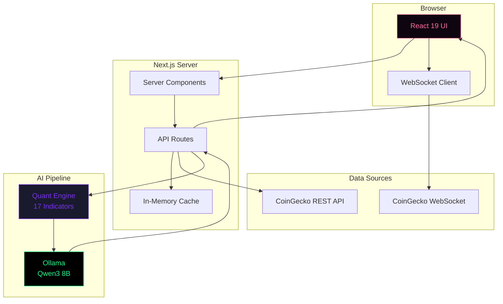
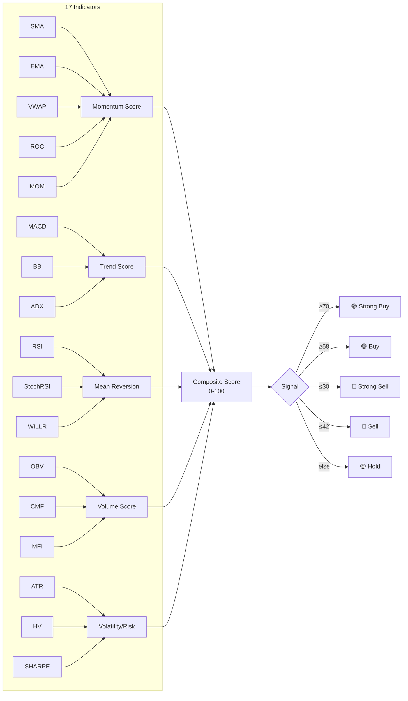

# 🪙 CryptoTrade

<div align="center">


**AI-Powered Cryptocurrency Analytics Platform**

Real-time market data • 17 quant indicators • Local LLM analysis • Beautiful glass-morphism UI

[Features](#-features) • [Architecture](#-architecture) • [Quick Start](#-quick-start) • [AI Analysis](#-ai-analysis) • [Deploy](#-deploy)

</div>

---

## ✨ Features

<table>
<tr>
<td width="50%">

### 📊 Market Intelligence
- **Real-time WebSocket** price & trade streaming
- **Interactive candlestick charts** via lightweight-charts
- **Top 50 coin rankings** by composite quant score
- **Market-wide AI summary** — bias, risk level, key themes
- **Trending coins** with 24h change indicators

</td>
<td width="50%">

### 🤖 AI Trend Analyzer
- **17 technical indicators** — SMA, EMA, RSI, StochRSI, MACD, Bollinger Bands, ATR, ADX, VWAP, OBV, CMF, MFI, Williams %R, ROC, Momentum, Historical Volatility, Sharpe Ratio
- **Local LLM** (Ollama + Qwen3 8B) for natural-language analysis
- **Structured output** — signal, confidence, reasoning, bullish/bearish factors
- **Graceful fallback** to quant-only when LLM unavailable

</td>
</tr>
<tr>
<td width="50%">

### 🎨 Modern UI/UX
- **Glass-morphism navbar** with backdrop blur
- **Dark theme** optimized for trading
- **Responsive design** — mobile to ultrawide
- **shadcn/ui components** with Radix primitives
- **Skeleton loading states** & empty states

</td>
<td width="50%">

### ⚡ Performance
- **Server Components** with Next.js App Router
- **60s cache** on all API routes
- **Concurrency-limited** batch requests (no rate-limiting)
- **Exponential backoff retry** on API failures
- **Turbopack** dev server

</td>
</tr>
</table>

---

## 🏗 Architecture



### Scoring Engine



---

## 🚀 Quick Start

### Prerequisites

- **Node.js** 20+
- **CoinGecko API Key** ([get one free](https://www.coingecko.com/en/api))
- **Ollama** (optional, for AI analysis)

### 1. Clone & Install

```bash
git clone https://github.com/Script-Kitty01/CryptoTrade.git
cd CryptoTrade
npm install
```

### 2. Environment Variables

Create `.env.local`:

```env
COINGECKO_BASE_URL=https://api.coingecko.com/api/v3
COINGECKO_API_KEY=CG-your_api_key_here
NEXT_PUBLIC_COINGECKO_API_KEY=CG-your_api_key_here
NEXT_PUBLIC_COINGECKO_WEBSOCKET_URL=wss://stream.coingecko.com/v1

# Local LLM (optional — falls back to quant-only if unavailable)
OLLAMA_BASE_URL=http://127.0.0.1:11434
OLLAMA_MODEL=qwen3:8b
ENABLE_LLM_ANALYSIS=true
OLLAMA_TIMEOUT_MS=30000
```

### 3. (Optional) Set Up Ollama for AI Analysis

```bash
# Install Ollama from https://ollama.com
ollama pull qwen3:8b    # ~5.2 GB download
ollama serve
```

### 4. Run

```bash
npm run dev
```

Open [http://localhost:3000](http://localhost:3000) 🎉

---

## 🤖 AI Analysis

CryptoTrade combines **quantitative analysis** with **local LLM reasoning** for unique market insights.

### How It Works

```
Coin Data → 17 Indicators → 5 Score Categories → Composite Score → LLM Prompt → Structured Analysis
```

### LLM Output

```json
{
  "signal": "buy",
  "confidence": 72,
  "summary": "BTC shows strong momentum with bullish MACD crossover...",
  "bullishFactors": ["MACD bullish crossover", "RSI recovering from oversold"],
  "bearishFactors": ["Volume declining", "Near resistance at $68K"],
  "risk": "medium",
  "reasoning": "The composite score of 68.5 is driven primarily by...",
  "confidenceExplanation": "Confidence is moderate due to mixed volume signals..."
}
```

### Market Summary

The `/trends` page sends the **top 5 ranked coins** to the LLM in a single call, producing:

- **Market Bias** — bullish / bearish / neutral
- **Risk Level** — low / medium / high
- **Key Theme** — e.g. "risk-on momentum", "defensive rotation"
- **Top Sectors** — inferred themes like "Layer 1 strength", "DeFi momentum"

> 💡 **No Ollama?** The app automatically falls back to quant-based analysis. All LLM features degrade gracefully.

---

## 📡 API Routes

| Route | Description | Cache |
|-------|-------------|-------|
| `GET /api/trends` | Top 50 coins ranked by composite quant score | 60s |
| `GET /api/trends/summary` | AI market summary (bias, risk, themes) | 60s |
| `GET /api/coins/[id]/analyze` | Full quant + LLM analysis for a coin | 60s |
| `GET /api/coins/[id]/quant` | Quant-only snapshot (no LLM) | 60s |
| `GET /api/search` | Search coins by name/symbol | — |
| `GET /api/search/trending` | Trending coins from CoinGecko | 60s |

---

## 🧪 Testing

```bash
npm run test:run     # Run all tests once
npm test             # Watch mode
```

**81 tests** across 6 test files covering:
- LLM response parsing & normalization
- Fallback analysis generation
- Prompt building & configuration
- Quant indicator computation
- Scoring engine thresholds

---

## 📁 Project Structure

```
cryptoweb/
├── app/
│   ├── api/
│   │   ├── coins/[id]/analyze/   # Quant + LLM analysis endpoint
│   │   ├── coins/[id]/quant/     # Quant-only endpoint
│   │   ├── trends/               # Top 50 ranking
│   │   ├── trends/summary/       # AI market summary
│   │   └── search/               # Search & trending
│   ├── coins/                    # Coin list & detail pages
│   ├── trends/                   # Trends ranking page
│   ├── layout.tsx                # Root layout
│   ├── page.tsx                  # Home page
│   └── globals.css               # Global styles + glass navbar
├── components/
│   ├── home/                     # Home page sections
│   ├── ui/                       # shadcn/ui primitives
│   ├── CandlestickChart.tsx      # OHLC candlestick chart
│   ├── CoinHeader.tsx            # Coin detail header
│   ├── QuantPanel.tsx            # AI analysis display
│   ├── TrendAnalyzer.tsx         # Analysis polling client
│   └── Header.tsx                # Glass-morphism navbar
├── hooks/
│   └── useCoingeckoWebsocket.ts  # WebSocket hook
├── lib/
│   ├── coingecko.actions.ts      # API fetcher + retry + concurrency
│   ├── quant.ts                  # 17 indicators + scoring engine
│   ├── llm.ts                    # Ollama integration + parsing
│   ├── utils.ts                  # Formatters & helpers
│   └── __tests__/                # Vitest test suites
├── public/                       # Static assets
├── constants.ts                  # App constants
└── type.d.ts                     # TypeScript definitions
```

---

## 🚢 Deploy

### Vercel (Recommended)

[](https://vercel.com/new)

1. Import `Script-Kitty01/CryptoTrade` on [Vercel](https://vercel.com)
2. Set the environment variables from `.env.local`
3. For AI features, expose your local Ollama via tunnel:

```bash
# Option A: localtunnel
npx localtunnel --port 11434

# Option B: Cloudflare Tunnel
cloudflared tunnel --url http://127.0.0.1:11434
```

4. Set `OLLAMA_BASE_URL` to your tunnel URL on Vercel

> ⚠️ The tunnel must stay running on your machine for LLM features. If it disconnects, the app falls back to quant-only analysis.

---

## 🛠 Tech Stack

| Category | Technology |
|----------|-----------|
| **Framework** | Next.js 16 (App Router, Turbopack) |
| **UI** | React 19, Tailwind CSS v4, shadcn/ui, Radix UI |
| **Language** | TypeScript 5 |
| **Charts** | lightweight-charts 5 |
| **Data** | CoinGecko REST + WebSocket |
| **AI** | Ollama + Qwen3 8B |
| **Testing** | Vitest + Testing Library + MSW |
| **Styling** | tw-animate-css, clsx, tailwind-merge |
| **Deployment** | Vercel |

---

## 📄 License

MIT © Script-Kitty01

---

<div align="center">

**Built with ❤️ and a lot of ☕**

[Report Bug](https://github.com/Script-Kitty01/CryptoTrade/issues) · [Request Feature](https://github.com/Script-Kitty01/CryptoTrade/issues)

</div>
